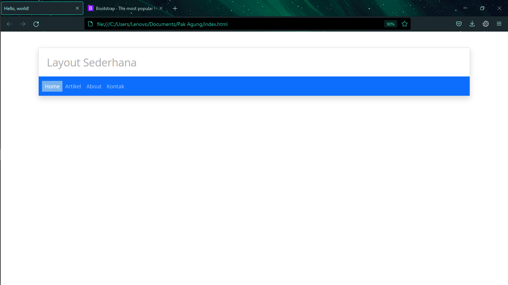
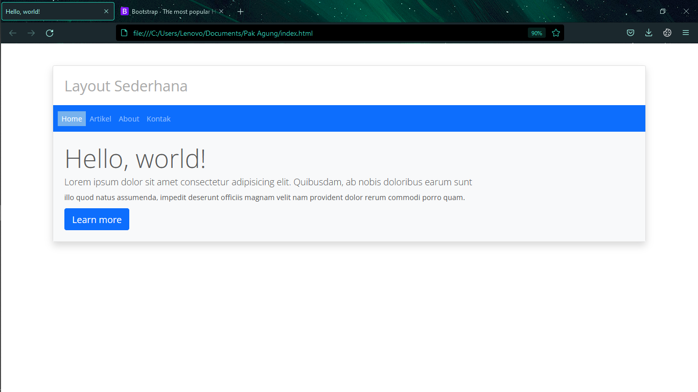
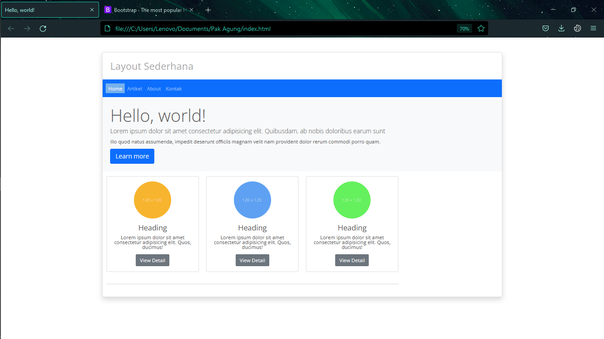
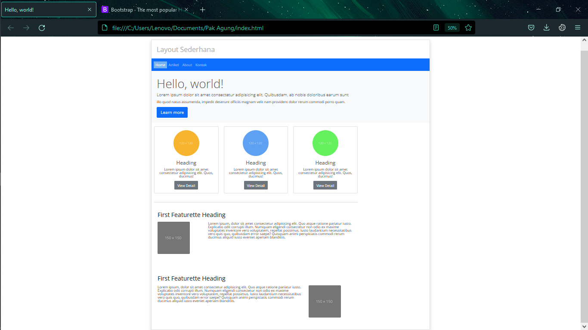
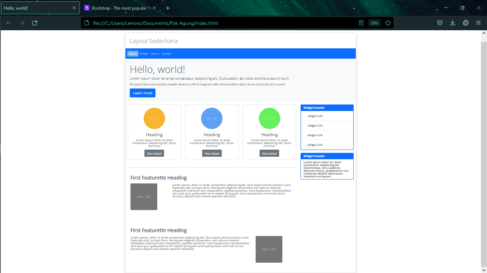
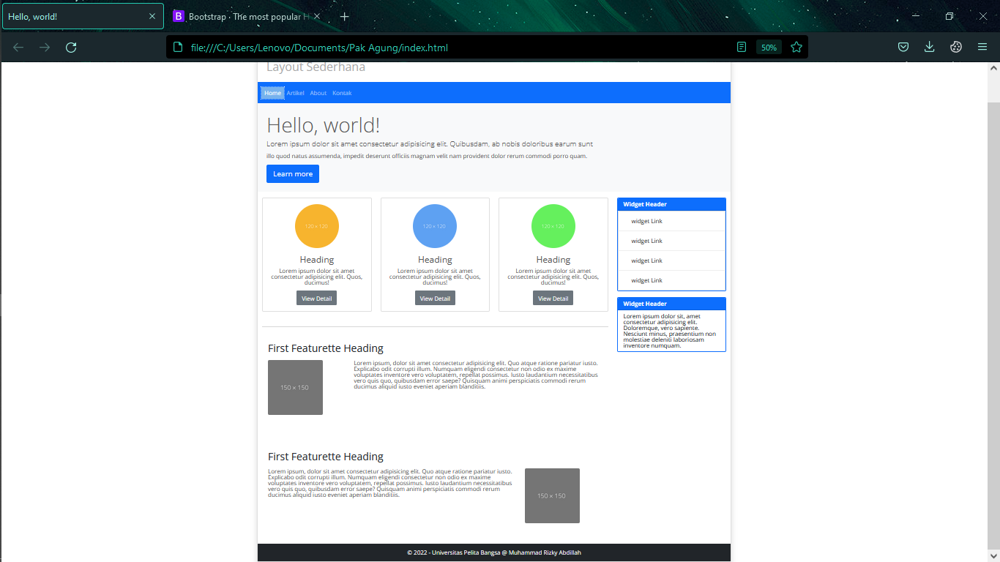

# Tugas Lab 6 Web
## Profil
| # | Biodata |
| -------- | --- |
| **Nama** | Muhammad Rizky Abdillah|
| **NIM** | 312010386 |
| **Kelas** | TI.20.A.2 |
| **Mata Kuliah** | Pemrograman Web |

## Praktikum 
1. Persiapkan text editor misalnya VSCode.
2. Buat folder baru dengan nama lab6_css_framework
3. Buat file baru dokumen html
4. Buat struktur dasar dari dokumen HTML.
5. Buatlah layout web sederhana menggunakan css frameword (Twitter Bootsrtap).
6. Lakukan validasi dokumen html dengan mengakses http://validator.w3.org

## 1. Install Bosstrap 
1. Kunjungi website resmi Bootstrap di [Booststrap.com](https://getbootstrap.com).
2. Dwonload Bosstrap atau anda bisa memilih menggunakan source code yang sudah disediakan tanpa harus mendownload
3. setelah anda sudah mendownload lalu ekstrak file masukan di dalam folder project anda lab6_css_framework 
4. lalu buat file dengan nama `index.html`
5. Lalu masukan struktur Kode html

```
<!DOCTYPE html>
<html lang="en">
<head>
    <meta charset="UTF-8">
    <meta http-equiv="X-UA-Compatible" content="IE=edge">
    <meta name="viewport" content="width=device-width, initial-scale=1.0">
    <title>Layout Sederhana</title>
</head>
<body>
    
</body>
</html>
```
* Tambahkan css bootstrap didalam tag `<head>`.
```
<!-- File bosstrap CSS -->
<link rel="stylesheet" href="css/bootstrap.min.css">
<link rel="stylesheet" href="css/style.css">
```
* atau anda dapat mencopy paste stylesheet bosstrap dalam template.
```
<link rel="stylesheet" href="https://cdn.jsdelivr.net/npm/bootstrap@4.6.1/dist/css/bootstrap.min.css"
integrity="sha384-zCbKRCUGaJDkqS1kPbPd7TveP5iyJE0EjAuZQTgFLD2ylzuqKfdKlfG/eSrtxUkn" crossorigin="anonymous">
```
* Tambahkan js bootstrap di dalam tag `<body>` dipaling bawah sebelum penutup.

```
<!-- File Bosstrap JS-->
<script src="js/bootstrap.min.js"></script>
```

* atau anda dapat mempaste JS yang sudah disediakan dalam tempalte bosstrap
```
<script src="https://cdn.jsdelivr.net/npm/jquery@3.5.1/dist/jquery.slim.min.js" integrity="sha384-DfXdz2htPH0lsSSs5nCTpuj/zy4C+OGpamoFVy38MVBnE+IbbVYUew+OrCXaRkfj" crossorigin="anonymous"></script>
<script src="https://cdn.jsdelivr.net/npm/bootstrap@4.6.1/dist/js/bootstrap.bundle.min.js" integrity="sha384-fQybjgWLrvvRgtW6bFlB7jaZrFsaBXjsOMm/tB9LTS58ONXgqbR9W8oWht/amnpF" crossorigin="anonymous"></script>
```

* Template HTML5 Pada bossttrap
```
<!doctype html>
<html lang="en">
  <head>
    <!-- Required meta tags -->
    <meta charset="utf-8">
    <meta name="viewport" content="width=device-width, initial-scale=1, shrink-to-fit=no">

    <!-- Bootstrap CSS -->
    <link rel="stylesheet" href="https://cdn.jsdelivr.net/npm/bootstrap@4.6.1/dist/css/bootstrap.min.css" integrity="sha384-zCbKRCUGaJDkqS1kPbPd7TveP5iyJE0EjAuZQTgFLD2ylzuqKfdKlfG/eSrtxUkn" crossorigin="anonymous">

    <title>Hello, world!</title>
  </head>
  <body>
    <h1>Hello, world!</h1>

    <!-- Optional JavaScript; choose one of the two! -->

    <!-- Option 1: jQuery and Bootstrap Bundle (includes Popper) -->
    <script src="https://cdn.jsdelivr.net/npm/jquery@3.5.1/dist/jquery.slim.min.js" integrity="sha384-DfXdz2htPH0lsSSs5nCTpuj/zy4C+OGpamoFVy38MVBnE+IbbVYUew+OrCXaRkfj" crossorigin="anonymous"></script>
    <script src="https://cdn.jsdelivr.net/npm/bootstrap@4.6.1/dist/js/bootstrap.bundle.min.js" integrity="sha384-fQybjgWLrvvRgtW6bFlB7jaZrFsaBXjsOMm/tB9LTS58ONXgqbR9W8oWht/amnpF" crossorigin="anonymous"></script>

    <!-- Option 2: Separate Popper and Bootstrap JS -->
    <!--
    <script src="https://cdn.jsdelivr.net/npm/jquery@3.5.1/dist/jquery.slim.min.js" integrity="sha384-DfXdz2htPH0lsSSs5nCTpuj/zy4C+OGpamoFVy38MVBnE+IbbVYUew+OrCXaRkfj" crossorigin="anonymous"></script>
    <script src="https://cdn.jsdelivr.net/npm/popper.js@1.16.1/dist/umd/popper.min.js" integrity="sha384-9/reFTGAW83EW2RDu2S0VKaIzap3H66lZH81PoYlFhbGU+6BZp6G7niu735Sk7lN" crossorigin="anonymous"></script>
    <script src="https://cdn.jsdelivr.net/npm/bootstrap@4.6.1/dist/js/bootstrap.min.js" integrity="sha384-VHvPCCyXqtD5DqJeNxl2dtTyhF78xXNXdkwX1CZeRusQfRKp+tA7hAShOK/B/fQ2" crossorigin="anonymous"></script>
    -->
  </body>
</html>
```

## Langkah 2 Membuat Layout Sederhana menggunakan bosstrap

1. Pertama anda membuat `index.html`
```
<!DOCTYPE html>
<html lang="en">
<head>
    <meta charset="UTF-8">
    <meta http-equiv="X-UA-Compatible" content="IE=edge">
    <meta name="viewport" content="width=device-width, initial-scale=1.0">
    <title>Layout Sederhana</title>
</head>
<body>
    
</body>
</html>
```
2. Tambahkan kodingan navbar letakanlah di dalam `body`
```
    <div class="container mt-5">
        <div class="card shadow">
            <h2 class="m-4" style="color: rgb(170, 170, 170);">Layout Sederhana</h2>
            <nav class="navbar navbar-expand-lg navbar-dark bg-primary">
                <div class="container-fluid">
                    <button class="navbar-toggler" type="button" data-bs-toggle="collapse" data-bs-target="#navbarNav"
                        aria-controls="navbarNav" aria-expanded="false" aria-label="Toggle navigation">
                        <span class="navbar-toggler-icon"></span>
                    </button>
                    <div class="collapse navbar-collapse" id="navbarNav">
                        <ul class="navbar-nav">
                            <li class="nav-item">
                                <a class="nav-link my-container active" aria-current="page" href="#">Home</a>
                            </li>
                            <li class="nav-item">
                                <a class="nav-link my-container" href="#">Artikel</a>
                            </li>
                            <li class="nav-item">
                                <a class="nav-link my-container" href="#">About</a>
                            </li>
                            <li class="nav-item">
                                <a class="nav-link my-container" href="#">Kontak</a>
                            </li>
                        </ul>
                    </div>
                </div>
            </nav>
```

3. Lalu tambakan artikel berikutnya, cari di bosstrap yaitu jumbtron, pada jumbotron ini ada di bagian versi `4 bosstrap`
```
 <!--Kontent awal untuk sebuah informasi-->
          <div class="jumbotron p-4 bg-light">
            <h1 class="display-4">Hello, world!</h1>
            <p class="lead">Lorem ipsum dolor sit amet consectetur adipisicing elit. Quibusdam, ab nobis doloribus earum sunt</p>
            <p>illo quod natus assumenda, impedit deserunt officiis magnam velit nam provident dolor rerum commodi porro quam.</p>
            <a class="btn btn-primary btn-lg" href="#" role="button">Learn more</a>
          </div>
```

4. lalu membuat halaman dengan menggunakan `card` template pada bosstrap
```
 <div class="row m-0 py-3">
                <div class="col-md-9">
                    <div class="row">
                        <div class="col-md-4">
                            <div class="card mb-3">
                                <div class="card-body text-center">
                                    
                                    <h4>Heading</h4>
                                    <p>Lorem ipsum dolor sit amet consectetur adipisicing elit. Quos, ducimus!</p>
                                    <a href="#" class="btn btn-secondary">View Detail</a>
                                </div>
                            </div>
                        </div>

                        <div class="col-md-4">
                            <div class="card mb-3">
                                <div class="card-body text-center">
                                    
                                    <h4>Heading</h4>
                                    <p>Lorem ipsum dolor sit amet consectetur adipisicing elit. Quos, ducimus!</p>
                                    <a href="#" class="btn btn-secondary">View Detail</a>
                                </div>
                            </div>
                        </div>
                        <div class="col-md-4">
                            <div class="card mb-3">
                                <div class="card-body text-center">
                                    
                                    <h4>Heading</h4>
                                    <p>Lorem ipsum dolor sit amet consectetur adipisicing elit. Quos, ducimus!</p>
                                    <a href="#" class="btn btn-secondary">View Detail</a>
                                </div>
                            </div>
                        </div>
                    </div>
```

5. Menambahkan konten artikel 
```
  <div class="artikel p-3 mt-4">
                      <div class="artikel">
                          <h3 class="text-dark mb-3">First Featurette Heading</h3>
                          <div class="row">
                              <div class="col-md-3"> 
                                  
                              </div>
                              <div class="col-md-9">
                                  <p>Lorem ipsum, dolor sit amet consectetur adipisicing elit. Quo atque ratione pariatur iusto. Explicabo odit corrupti illum. Numquam eligendi consectetur non odio ex maxime voluptates inventore vero voluptatem, repellat possimus. Iusto laudantium necessitatibus vero quis quo, quibusdam error saepe? Quisquam animi perspiciatis commodi rerum ducimus aliquid iusto eveniet aperiam blanditiis.</p>
                              </div>
                          </div>
                      </div>
                  </div>
                  <hr class="my-4">
                  <div class="artikel p-3 my-4">
                      <div class="artikel">
                          <h3 class="text-dark mb-3">First Featurette Heading</h3>
                          <div class="row">
                              <div class="col-md-9">
                                  <p>Lorem ipsum, dolor sit amet consectetur adipisicing elit. Quo atque ratione pariatur iusto. Explicabo odit corrupti illum. Numquam eligendi consectetur non odio ex maxime voluptates inventore vero voluptatem, repellat possimus. Iusto laudantium necessitatibus vero quis quo, quibusdam error saepe? Quisquam animi perspiciatis commodi rerum ducimus aliquid iusto eveniet aperiam blanditiis.</p>
                              </div>
                              <div class="col-md-3">
                                  
                              </div>
                          </div>
                      </div>
                  </div>
              </div>
```


6. selanjautnya menambahkan artikel widget menggunakan `card` pada bosstrap 

```
<div class="col-md-3">
                  <div class="card border border-primary mb-3">
                      <div class="card-header bg-primary text-white fw-bold">
                          Widget Header
                      </div>
                      <ul class="list-group">
                          <li class="list-group-item"><a href="#">widget Link</a></li>
                          <li class="list-group-item"><a href="#">widget Link</a></li>
                          <li class="list-group-item"><a href="#">widget Link</a></li>
                          <li class="list-group-item"><a href="#">widget Link</a></li>
                      </ul>
                  </div>
                  <div class="card border border-primary ">
                      <div class="card-header bg-primary text-white fw-bold">
                          Widget Header
                      </div>
                      <ul class="list-group list-group-flush">
                          <li class="list-group-item">
                              Lorem ipsum dolor sit, amet consectetur adipisicing elit. Doloremque, vero sapiente.
                              Nesciunt minus, praesentium non molestiae deleniti laboriosam inventore numquam.
                          </li>
                      </ul>
                  </div>
              </div>
          </div>
```

7. Lalu yang terakhir membuat bagian `footer` untuk ditaruh di paling bawah layout 
```
 <footer class="bg-dark text-white p-3 text-center">&copy; 2022 - Universitas Pelita Bangsa @ Muhammad Rizky Abdillah</footer>
```


8. setelah itu kita kasih style baru lalu kita buat dengan file `style.css`
```
@import
url('https://fonts.googleapis.com/css2?family=Open+Sans:ital,wght@0,300;0,400;0,600;0,700;0,800;1,300;1,400;1,600;1,700;1,800&display=swap');
@import
url('https://fonts.googleapis.com/css2?family=Open+Sans+Condensed:ital,wght@0,300;0,700;1,300&display=swap');
body {
 line-height:1;
 font-size:100%;
 font-family:'Open Sans', sans-serif;
 color:#5a5a5a;
}
.active, .nav-link:hover {
    background-color: rgb(119, 178, 237);
}

nav, .container-fluid {
    padding: 5px;
    margin: 0px;
}
.list-group li {
    border-bottom: 1px solid #eee;
}
.list-group li a {
   padding: 10px 20px;
   color: #333;
   display: block;
   text-decoration: none; 
}
.list-group li:hover a {
    background-color: rgb(218, 212, 212) ;
}

.list-group p {
    padding: 15px;
    line-height: 25px;
}
/* widget box decorasi*/
.card-header .title {
    padding: 10px 16px;
    background-color: rgb(104, 104, 216);
    color: white;
}
.list-group ul {
    list-style-type: none;
}


```